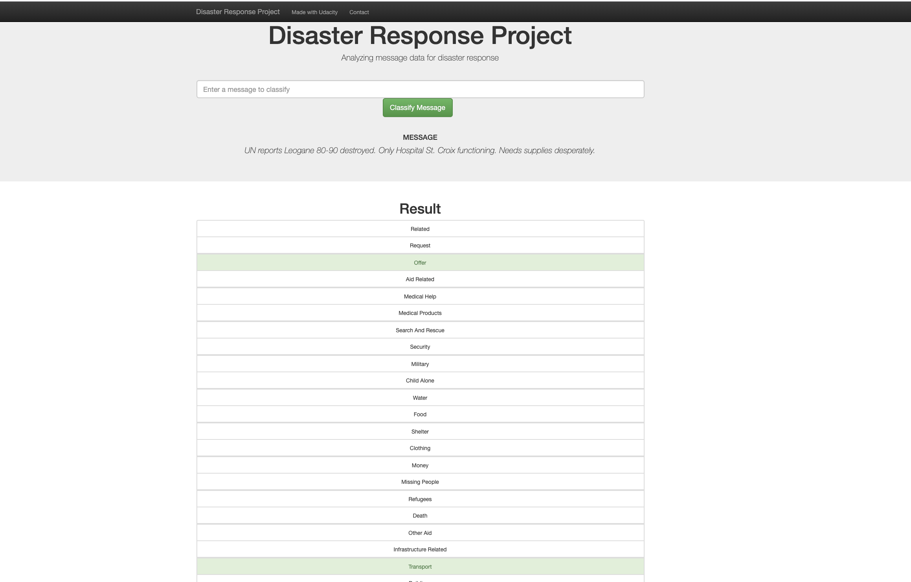
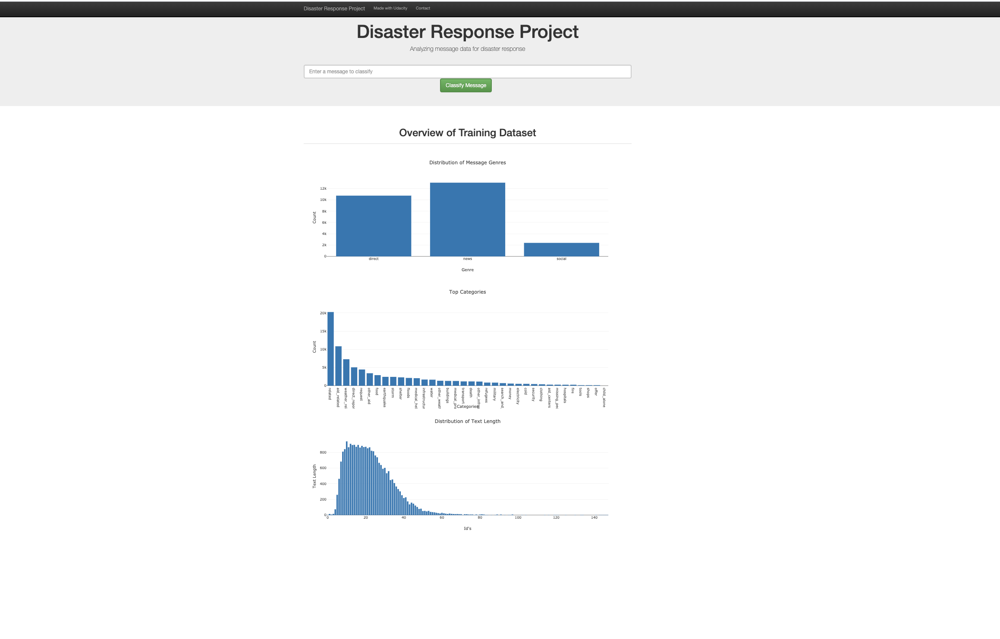

# Disaster Response Pipeline Project

## Project Overview

In this course, you've learned and built on your data engineering skills to expand your opportunities and potential as a data scientist. In this project, you'll apply these skills to analyze disaster data from Figure Eight to build a model for an API that classifies disaster messages.

In the Project Workspace, you'll find a data set containing real messages that were sent during disaster events. You will be creating a machine learning pipeline to categorize these events so that you can send the messages to an appropriate disaster relief agency.

Your project will include a web app where an emergency worker can input a new message and get classification results in several categories. The web app will also display visualizations of the data. This project will show off your software skills, including your ability to create basic data pipelines and write clean, organized code!

Below are a few screenshots of the web app.

## File structure of the Project

    .
    ├── app     
    │   ├── run.py                           # Flask file that runs app
    │   └── templates   
    │       ├── go.html                      # Classification result page of web app
    │       └── master.html                 # Main page of web app    
    ├── data                   
    │   ├── disaster_categories.csv          # Dataset including all the categories  
    │   ├── disaster_messages.csv            # Dataset including all the messages
    │   └── process_data.py                  # Data cleaning
    ├── models
    │   └── train_classifier.py              # Train ML model           
    └── README.md
    

### Instructions:
1. Run the following commands in the project's root directory to set up your database and model.

    - To run ETL pipeline that cleans data and stores in database
        `python data/process_data.py data/disaster_messages.csv data/disaster_categories.csv data/DisasterResponse.db`
    - To run ML pipeline that trains classifier and saves
        `python models/train_classifier.py data/DisasterResponse.db models/classifier.pkl`

2. Run the following command in the app's directory to run your web app.
    `python run.py`

3. Go to http://0.0.0.0:3001/
